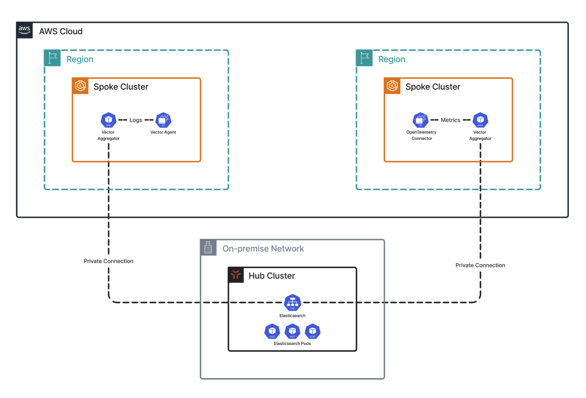

# flux-fleet-management

Central GitOps repository for cluster fleet management with the Kubernetes Flux Operator.

## Overview

> [!NOTE]
> This repository follows the [ControlPlane Enterprise for Flux CD]("https://fluxcd.control-plane.io/") reference architecture.
> The `d2` reference architecture comprised of [d2-fleet](https://github.com/controlplaneio-fluxcd/d2-fleet), [d2-infra](https://github.com/controlplaneio-fluxcd/d2-infra) and [d2-apps](https://github.com/controlplaneio-fluxcd/d2-apps) is a set of best practices and production-ready examples for using Flux Operator and OCI Artifacts to manage the continuous delivery of Kubernetes infrastructure and applications on multi-cluster multi-tenant environments.

This repository serves as the main entry point for the Flux Operator running on Kubernetes. Flux is pointed at a specific cluster directory (e.g., `prod-us-1`, `prod-eu-1`, `staging-1`) and applies resources with cluster-specific overrides, such as different cluster domains or naming conventions. 
With this structure, scaling the number of clusters becomes trivial, as the same global configurations, add-ons, and tenants can be applied across all cluster inventory just by bootstrapping Flux with a new entry point.

### Repository Structure

```shell
flux-fleet-management/
├── clusters                      # Cluster-specific entrypoints
│   ├── prod-us-1
│   │   ├── flux-system           
│   │   │   ├── flux-instance.yml
│   │   │   ├── flux-operator.yml
│   │   │   └── runtime-info.yml
│   │   ├── kustomization.yml
│   │   ├── policy.yml
│   │   └── tenants.yml
│   └── staging
│       └── flux-system
├── policy                         # Policy resources (Network Policies, RBAC, Resources)
│   ├── blueprints
│   │   └── flux-source-policy.yml
│   ├── identity
│   │   └── vault-rbac.yml
│   └── kustomization.yml
├── tenants                        # Cluster tenants and vending templates
│   ├── apps.yml
│   ├── infra.yml
│   └── kustomization.yml
└── terraform                      # Terraform to bootstrap Flux
    ├── values
    │   ├── instance.yml
    │   └── operator.yml
    ├── main.tf
    ├── outputs.tf
    ├── terraform.tf
    └── variables.tf
```

## Hub and Spoke Model

The architecture behind this multi-cluster management approach is a Hub and Spoke model where a central hub cluster manages core platform services and orchestration for spoke clusters, which host application workloads.



### Hub Cluster

A hub (management) cluster hosts core platform management services where decentralization may degrade the service quality. For example, duplicating an Elastic Stack deployment across clusters makes it more difficult to manage obervability across the entire environment. Keeping Elastic Stack centralized provides a single pane of glass to query logs and metrics for every cluster in the environment.

A hub cluster may also host Flux Image Automation components, which allows centralized management of image updates across all spoke clusters.

### Spoke Clusters

A spoke (workload) cluster is dedicated to hosting application workloads, which can benefit from a multi-region deployment across multiple clusters. Because the set of application workloads is defined in the repository, onboarding new spoke clusters is as simple as adding a new cluster to the `clusters/` directory and attaching the list of global and workload applications to it via the tenant Kustomization. Once bootstrapped, the Flux Operator in the spoke will deploy all attached applications to the cluster.

## Repository Components

### Runtime Info

Each cluster directory contains its own `runtime-info.yml`. This ConfigMap contains values that are specific to the cluster and can be used to template values in upstream configurations, which allows applications to use certain configurations conditionally based on the context of the cluster they're running in. These values can be extended to support more cluster-specific variables as needed.

| Key              | Description                                          |
| ---------------- | ---------------------------------------------------- |
| `ENVIRONMENT`    | The environment of the cluster (`production`, `staging`). |
| `CLUSTER_NAME`   | The name of the cluster (`prod-us-1`, `prod-eu-1`). |
| `CLUSTER_DOMAIN` | The cluster's internal domain (`prod-us-1.ilysium.io`, `staging-1.ilysium.io`).
| `CLUSTER_TYPE`   | The type of cluster (`kubernetes`, `eks`, `aks`, or `gks`). |
| `CLUSTER_ROLE`   | The cluster's architectural role (`hub` or `spoke`).

### Policy

The `policy/` directory serves as the main collection of policies that govern the clusters. This includes:
  - Network Policies
  - RBAC
  - Admission & Mutating Webhooks

### Tenants

The `tenants/` directory controls the list of cluster tenants. Tenants are organized into the following groups based on profile and cluster roles:

- **Infrastructure Tenants** (`infra.yml`) — A cluster operator or add-on that extends the functionality of the standard Kubernetes API and typically has higher privileges than a standard Kubernetes application. Because they are platform-level components, infrastructure tenants are managed centrally in the [`flux-infra-mangement`]("https://github.com/black-quartz/flux-infra-management") repository.

- **Global Application Tenants** (`global.yml`) - Applications that are deployed to every cluster in the environment for management purposes. This can include components such as log and metrics collectors, which are deployed to all clusters to ship observability data back to the hub.

- **Platform Application Tenants** (`platform.yml`) - Applications that are only deployed to the hub cluster. These applications are platform shared services that are centrally managed and used by applications running in multiple other clusters.

- **Workload Application Tenants** (`apps.yml`) — Applications that are deployed to spoke clusters. These applications are standard workloads (such as microservices) that can be deployed to multiple clusters across different regions to provide better performance and availability.

### Vending

Tenant namespaces are vended using Flux **ResourceSets**, which allow a platform admin to define a set of resources to create for a specific input, like a list of JSON or YAML objects. This approach is beneficial for the following reasons:
- **Scalability** — Tenants can be onboarded to the platform simply by adding a new input object, which supports programmatic onboarding.

- **Flexibility** — The platform tenant template can be easily modified to support new base configurations (new `ResourceQuotas`, `LimitRanges`, etc.).

- **Security** — Tenants are granted a scoped service account by default, ensuring they only have permissions to modify resources within their own namespace.

## Terraform Flux Bootstrap

The Terraform code in this repository serves only as a mechanism to bootstrap Flux on a cluster with a single command; it is not used to manage the ongoing configuration of Flux on Kubernetes. 

After the initial `terraform apply` is run to install Flux on the cluster and point the `FluxInstance` at its target `clusters/` directory, the Terraform state is no longer required, as Flux manages its own configuration by pulling in `flux-operator.yml` and `flux-instance.yml` manifests.
